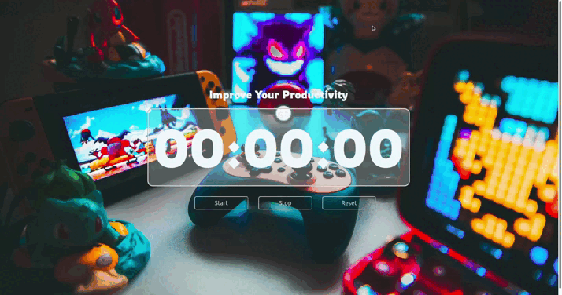

# Description

### :stopwatch: Simple stopwatch to track your performance during working or studying (or whatever you tend to do).

# Features

### There are two options (buttons):

- START (to turn on the stopwatch and blur background image)
- STOP (to turn off the stopwatch and desaturate blured background)
- RESET (reloading stopwatch and turning back the background to the normal state)

# Demo

